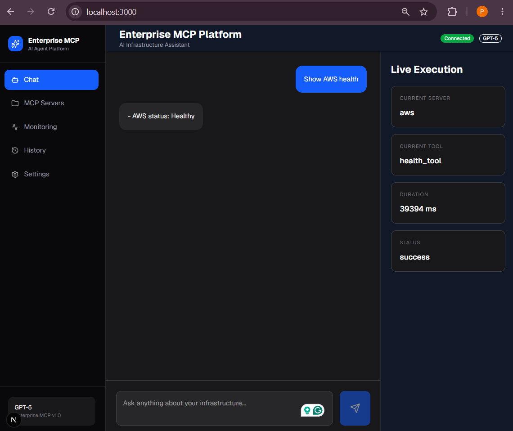
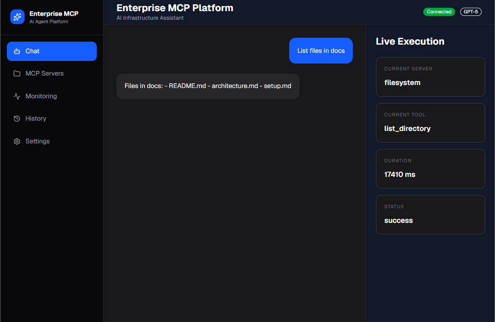
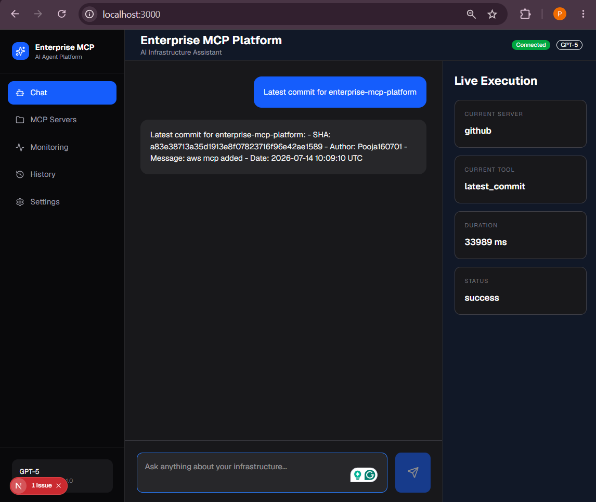
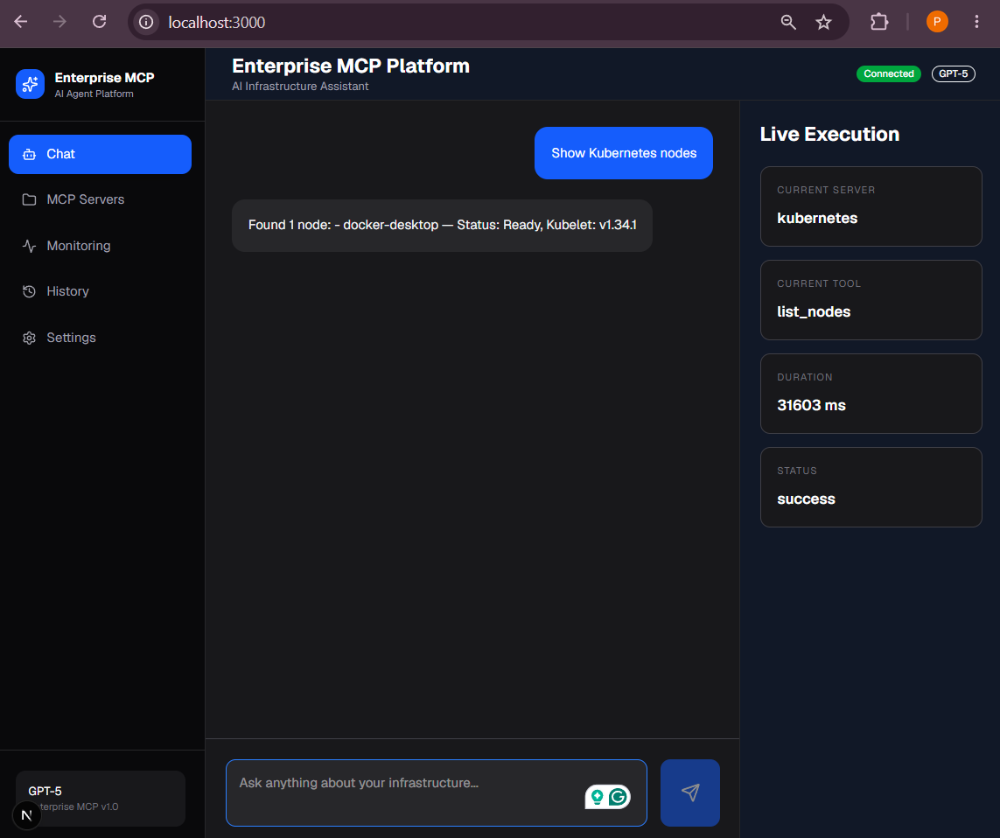
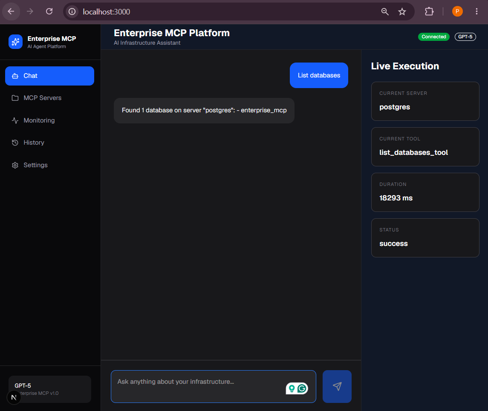

# Enterprise MCP Platform

> An enterprise-grade AI orchestration platform built on the **Model Context Protocol (MCP)** that enables intelligent tool execution, plugin management, workflow automation, governance, and observability through a modern web interface.


---

## Overview

Enterprise MCP Platform is a production-oriented platform that demonstrates how AI agents can securely interact with external systems using the **Model Context Protocol (MCP)**.

The platform combines a FastAPI backend, a modern Next.js frontend, an extensible plugin architecture, enterprise governance, observability, and multiple MCP servers into a unified AI orchestration system.

Rather than building a single chatbot, this project focuses on the infrastructure required to operate AI agents safely and reliably in enterprise environments.

---

## Features

### AI Gateway

- FastAPI REST API
- Chat endpoint
- Tool routing
- Context management
- Conversation handling
- OpenAI integration

### MCP Core

- MCP session management
- Tool discovery
- Tool execution
- Server registry
- Transport layer
- Configuration management

### Plugin System

- Dynamic plugin loading
- Plugin registry
- Version management
- Sandbox execution
- Hot reloading

### Planning & Execution

- Dependency planning
- Parallel execution
- Retry management
- Timeout handling
- Cost optimization

### Governance

- RBAC
- Policy engine
- Compliance rules
- Rate limiting
- Secret access policies
- Tool permissions

### Observability

- Structured logging
- Prometheus metrics
- Grafana dashboards
- OpenTelemetry
- Distributed tracing

### Memory

- Conversation history
- Session memory
- Long-term memory
- Semantic search
- Memory compression

### Hybrid Search

- BM25 search
- Keyword search
- Metadata filtering
- Ranking fusion
- Vector search abstraction

### Frontend

- Next.js App Router
- TypeScript
- Modern dashboard
- Chat interface
- Server management
- Monitoring pages

---

# Project Structure

```text
enterprise-mcp-platform/

├── ai-gateway/
├── frontend/
├── mcp-servers/
├── monitoring/
├── infrastructure/
├── docs/
├── tests/
└── docker-compose.yml
```

A complete explanation of every directory is available in:

```
docs/project-structure.md
```

---

# Architecture

```
                    User
                      │
                      ▼
             Next.js Frontend
                      │
                      ▼
               FastAPI Gateway
                      │
        ┌─────────────┼─────────────┐
        ▼             ▼             ▼
     Planner      Plugin System  Governance
        │             │             │
        └─────────────┼─────────────┘
                      ▼
                  MCP Core
                      │
        ┌─────────────┼─────────────┐
        ▼             ▼             ▼
   GitHub        Kubernetes      Docker
   Server           Server        Server
```

More detailed architecture:

```
docs/architecture.md
```

---

# Technology Stack

## Backend

- Python
- FastAPI
- Pydantic
- Uvicorn

## Frontend

- Next.js
- React
- TypeScript

## AI

- OpenAI API
- Model Context Protocol (MCP)

## DevOps

- Docker
- Docker Compose
- Kubernetes
- GitHub Actions

## Monitoring

- Prometheus
- Grafana
- OpenTelemetry

## Testing

- Pytest

---

# Quick Start

## Clone

```bash
git clone https://github.com/<username>/enterprise-mcp-platform.git

cd enterprise-mcp-platform
```

---

## Environment

Create a `.env` file.

Example:

```env
OPENAI_API_KEY=your_key_here

MODEL_NAME=gpt-4o-mini

LOG_LEVEL=INFO
```

---

## Run with Docker

```bash
docker compose build

docker compose up
```

---

## Backend

```
http://localhost:8000
```

Swagger

```
http://localhost:8000/docs
```

---

## Frontend

```
http://localhost:3000
```

---

## Monitoring

Prometheus

```
http://localhost:9090
```

Grafana

```
http://localhost:3001
```

---

# Documentation

| Document | Description |
|-----------|-------------|
| architecture.md | System architecture |
| project-structure.md | Repository overview |
| installation.md | Local setup |
| configuration.md | Environment variables |
| backend.md | FastAPI backend |
| frontend.md | Next.js frontend |
| api.md | REST API reference |
| docker.md | Docker deployment |
| monitoring.md | Prometheus & Grafana |
| testing.md | Test strategy |
| deployment.md | Production deployment |

---

# Testing

Backend

```bash
pytest
```

Docker

```bash
docker compose up
```

Frontend

```bash
npm run dev
```

---

# Screenshots











---

# Contributing

Contributions, bug reports, and feature requests are welcome.

Please read:

```
CONTRIBUTING.md
```

---

# License

This project is licensed under the MIT License.

See:

```
LICENSE
```

---

# Author

**Pooja**

GitHub: https://github.com/Pooja160701

---